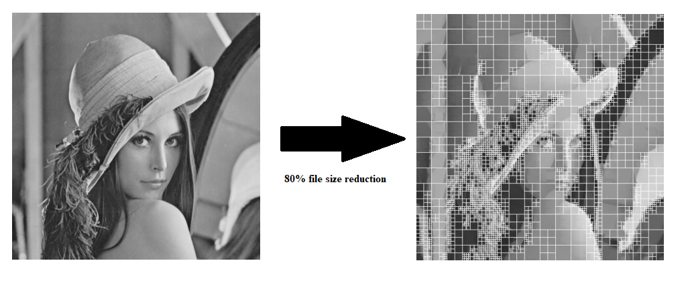

[](https://coveralls.io/github/Ja-Gk-00/Fast-Fractal-Compression) [](https://github.com/Ja-Gk-00/Fast-Fractal-Compression/actions/workflows/ci.yml)

# Fast Fractal 


This documentation describes how to use Fast Fractal’s **Python** API to encode and decode images (arrays or files), how the main parameters affect quality/speed/size, and how to set up practical benchmarks and parameter sweeps.
**Warning**. The package is in its early stages of development and some functionalities may not work optimally.


## 1. Installation & Imports
-------------------------

Install through the [uv package manager](https://docs.astral.sh/uv/getting-started/installation/) from the project's root:

```bash
uv sync
```

For development, sync with `dev` group:

```bash
uv sync --group dev
```

To seamlessly run notebooks, sync with `notebooks` group:

```bash
uv sync --group notebooks
```

For running benchmarks, use `bench` group:

```bash
uv sync --group bench
```

### 1.1 Data Model Overview
----------------------

#### Images as arrays
FastFractal operates on:
- grayscale: `x.shape == (H, W)`
- RGB: `x.shape == (H, W, 3)`

The recommended dtype/range is:
- `x.dtype == np.float32`
- values in `[0.0, 1.0]`

#### `FractalCode`
`encode_array(...)` returns a `FractalCode` object (a compact, structured representation of the fractal encoding). It contains image metadata (original size/channels) and the learned mapping data needed for decoding.

You typically do **not** manually modify `FractalCode`; you either:
- keep it in memory and call `decode_array(code, iterations=...)`, or
- persist it with `encode_to_file(...)` and restore it with `decode_to_file(...)`.

---

## 2. Quick-start: Encode/Decode Arrays
-----------------------------------

### 2.1 Load an image into float32
```python
from PIL import Image
import numpy as np

im = Image.open("input.png").convert("RGB")
x_u8 = np.asarray(im, dtype=np.uint8)
x = (x_u8.astype(np.float32) / 255.0).astype(np.float32, copy=False)  # [0,1], float32
```

### 2.2 Encode/Decode
```python
code = encode_array(
    x,
    max_block=16,
    min_block=8,
    stride=4,
    topk=16,
    entropy_thresh=0.0,
    max_domains=256,
    use_quadtree=False,
    quantized=True,
)

rec = decode_array(code, iterations=8)
rec = np.clip(rec, 0.0, 1.0).astype(np.float32, copy=False)
```

### 2.3 Save reconstruction
```python
rec_u8 = (np.clip(rec, 0.0, 1.0) * 255.0 + 0.5).astype(np.uint8)
Image.fromarray(rec_u8).save("decoded.png")
```

Notes:
- `iterations` controls convergence: more iterations often improves quality, but increases runtime.
- For grayscale images, use `.convert("L")` and expect `rec.shape == (H, W)`.

---

### 2.3 Notebooks

For more information and "hands on" guide on running the package you can look into jupyter notebooks available under `notebooks` directory, where simple use-cases have been presented.

## 3. Encode/Decode to a file
-------------------------------------

This is the recommended pipeline to save an image to a file.

```python
from pathlib import Path

in_img = Path("input.png")
out_code = Path("out.ffc")
out_dec = Path("decoded.png")

encode_to_file(
    in_img,
    out_code,
    max_block=16,
    min_block=8,
    stride=4,
    topk=16,
    entropy_thresh=0.0,
    max_domains=256,
    use_quadtree=False,
    quantized=True,
)

decode_to_file(out_code, out_dec, iterations=8)
```

## 4. Parameter reference

This section describes the encoding parameters you are expected to tune. Unless stated otherwise, all parameters apply to `encode_array`, and `encode`/`encode_to_file` pass them through.

### 4.1 Core parameters

- `pool_blocks: list[int]`  
  Block sizes (in pixels) used for range blocks. Typical: `[8]`, `[16]`, or multi-scale like `[16, 8]`.

- `dom_stride: int`  
  Stride (in pixels) for enumerating domain candidates. Smaller stride increases candidates (slower) but often improves quality.

- `k: int`  
  Number of best domain candidates retained per range (Top‑K). Larger improves search coverage but increases compute.

- `iters: int`  
  Iteration hint stored in the code; decoding still uses the explicit `iterations` parameter. Typical: 6–12.

- `quantized: bool`  
  If `True`, store parameters in 8‑bit quantized form (smaller codes, faster IO). If `False`, store float32 scaling/offset (larger codes).

- `s_clip: float`  
  Maximum absolute scaling factor during quantization. Scaling is clipped to `[-s_clip, +s_clip]` before mapping to 8‑bit.

- `o_min: float`, `o_max: float`  
  Output offset range used during quantization, mapped to 8‑bit. In normalized images, typical is `[0.0, 1.0]`.

- `transform_ids: list[int] | None`  
  Subset of transform IDs to consider. `None` defaults to canonical `0..7`.

### 4.2 Advanced parameters

- `backend: str`  
  Implementation backend for similarity/top‑k selection (pure Python variants). Use the library default unless benchmarking.

- `use_quadtree: bool`  
  Enables adaptive partitioning. When `True`, blocks may be split recursively if fit error is above threshold.

- `qt_min_size: int`  
  Minimum leaf size for quadtree splitting.

- `qt_eps: float`  
  Error threshold for quadtree decisions. Lower values split more aggressively (slower, potentially higher quality).

- `use_buckets: bool`  
  Enables bucket-based candidate reduction (speed optimization). Useful for large images.

- `bucket_bits: int`  
  Controls bucket granularity (more bits → more buckets, often better quality but less pruning benefit).

- `seed: int`  
  Random seed used where the search uses randomized sampling.

- `entropy_thresh: float`  
  Optional heuristic threshold for skipping low-entropy content (if supported by your build). Keep default unless you know you need it.

---

## 5. Benchmarks and parameter-space search (config tutorial)

The recommended workflow is:
1. Define a **benchmark dataset** (images, sizes, color modes).
2. Define a **parameter space** via a config file.
3. Run benchmarks with **warmup** and repeated measurements.
4. Select best settings using a primary objective (e.g., PSNR at fixed runtime budget).

### 5.1 Benchmark dataset layout

A minimal benchmark directory:

```
bench/
  images/
    lena.png
    peppers.png
    barnsley_fern.png
  results/
  configs/
```

Recommendations:
- Use a mix of textures (high-frequency) and smooth regions.
- Include both grayscale and RGB if you intend to support both.
- Keep a fixed input normalization (the library expects float32 in [0,1]).

### 5.2 Config file: defining a parameter grid

Use a simple YAML (or JSON) “grid search” format: each key maps to a list of candidate values. The benchmark runner enumerates the cartesian product.

Example (`bench/configs/grid.yaml`):

```yaml
images:
  - "bench/images/lena.png"
  - "bench/images/peppers.png"

decode_iterations: [6, 8, 10]

grid:
  pool_blocks:
    - [16]
    - [16, 8]

  dom_stride: [4, 8]
  k: [16, 32]
  quantized: [true]

  transform_ids:
    - [0, 1, 2, 3, 4, 5, 6, 7]
    - [0, 4]
    - [0, 1, 2, 3, 4, 5, 6, 7, 8, 9]

  use_quadtree: [false, true]
  qt_min_size: [8]
  qt_eps: [0.01, 0.02]
```

How to interpret `transform_ids` in the grid:
- Each entry is a **single candidate set** of transforms.
- The benchmark runner should pass that list directly into `encode_array(..., transform_ids=...)`.


### 5.3 Benchmark run settings

To produce stable results:
- **Warmup:** run 1–3 encode/decode cycles before timing (CPU caches, JIT effects in NumPy).
- **Iterations:** time each configuration for at least 3–10 runs and report mean/median.
- **Metrics:** at minimum:
  - Runtime (encode and decode separately)
  - Reconstruction quality (e.g., PSNR; optionally SSIM)
  - Code size (bytes)

A typical reporting row:
- `image`, `H×W×C`, `params`, `encode_ms`, `decode_ms@iters`, `psnr_db`, `size_bytes`
